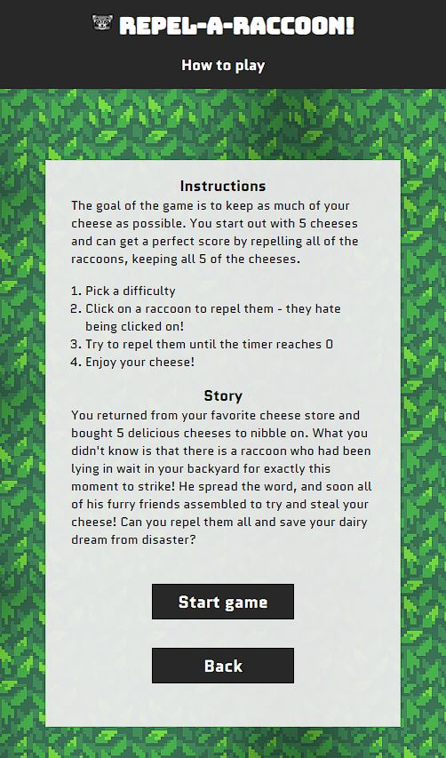
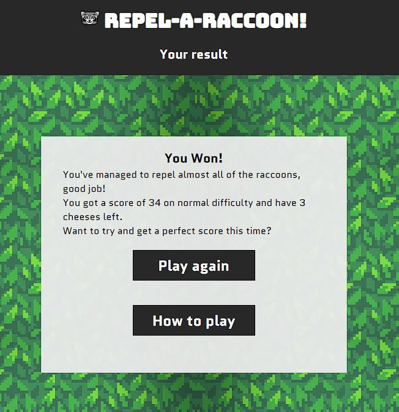
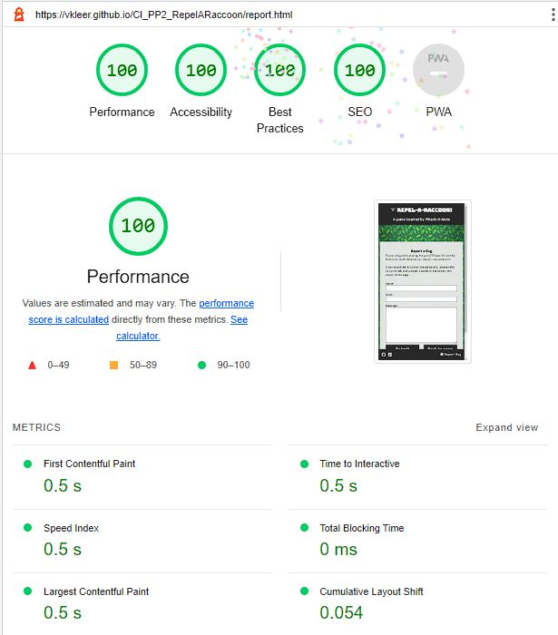

# Repel-A-Raccoon
(Developer: Vilayat Kleer)

[View the live website](https://vkleer.github.io/CI_PP2_RepelARaccoon/)

## Table of Contents

1. [Project Goals](#project-goals)
    1. [User Goals](#user-goals)
    2. [Website Owner Goals](#site-owner-goals)
2. [User Experience](#user-experience)
    1. [Target Audience](#target-audience)
    2. [User Requirements and Expectations](#user-requirements-and-expectations)
    3. [User Stories](#user-stories)
3. [Design](#design)
    1. [Design Choices](#design-choices)
    2. [Colour](#colour)
    3. [Fonts](#fonts)
    4. [Structure](#structure)
    5. [Wireframes](#wireframes)
4. [Technologies Used](#technologies-used)
    1. [Languages](#languages)
    2. [Tools](#tools)
5. [Features](#features)
6. [Testing](#validation)
    1. [HTML Validation](#html-validation)
    2. [CSS Validation](#css-validation)
    3. [Accessibility](#accessibility)
    4. [Performance](#performance)
    5. [Testing on Different Devices](#testing-on-different-devices)
    6. [Browser Compatibility](#browser-compatibility)
    7. [Testing User Stories](#testing-user-stories)
8. [Bugs](#Bugs)
9. [Deployment](#deployment)
10. [Credits](#credits)
11. [Acknowledgements](#acknowledgements)

## Project Goals

### User Goals
- Play a casual and fun clicking/tapping game 
- See if you're fast enough to beat every difficulty level

### Website Owner Goals
- Creating a casual and fun game that has replay value
- Have the website and game be responsive to work on any device

## User Experience

### Target Audience
- People who like browser-based games
- People who like whack-a-mole games
- People who want to play a quick, fun game
- Casual gamers

### User Requirements and Expectations
- Minimalistic, simple way to navigate the website and game
- Fun game that anyone can pick up and play
- Visually appealing website and game that's consistent in style, no matter the device
- A way to report bugs if any are found
- Meeting accessibility and readability standards

### User Stories

#### User
1. As a user, I want to be able to play the game on different difficulty levels
2. As a user, I want to be able to read the game instructions before playing the game
3. As a user, I want to see how much time there is left to play the game
4. As a user, I want to see my score during and after the game
5. As a user, I want to see how many lives I have left in the game
6. As a user, I want to receive feedback after I won the game
7. As a user, I want to receive feedback after I lost the game

#### Site owner
8. As the website owner, I want users to be able to report a bug
9. As the website owner, I want user to receive feedback after submitting a bug report
10. As the website owner, I want users to be able to contact me personally on social media
11. As the website owner, I want to provide an interactive and responsive game that works on all devices

## Design

### Design Choices
The game was designed to as an animal-friendly, casual game to kill some time. Instead of whacking moles with a hammer, you 'repel' raccoons by clicking or tapping on them as they pop up from a bush, removing any link to animal abuse from the game. 

Both the website and game incorporate the pixel art style, which is an art genre I personally enjoy. The simple style is nostalgic and reinforces the indie-game vibe that I was looking for in this project. Although the background of the website was made by someone else (see credits), the sprites for the game were made by myself.

### Colour

The colours that I used for the website are based off the colours I used for the sprites in the game. I designed the sprites early on to help guide the style of the website.

The background is a repeating pixel art pattern of green grass, which complements the orange colour that is used for all hover effects on the anchor and button elements. The orange colour comes from the cheese sprite that I designed in Adobe Illustrator.

The header and footer use a dark gray colour to stand out from the bright colours used in the game and background. The dark gray colour was picked to keep the website balanced.

Colour palette

    

### Fonts
The fonts that I used are Bungee and Quantico. Bungee is used in the logo and the rest of the website and game uses Quantico with different font weights. Both fonts have a playfulness to them and add to the pixel art style that is used. 

The [Bungee font](https://fonts.google.com/specimen/Bungee?query=bungee) is slightly rounded but still blocky and game-like. It stands out next to the angular Quantico font - which is why I used it for the logo.

The [Quantico font](https://fonts.google.com/specimen/Quantico?query=quantico) reminds me of a modern version of the [GameBoy font](https://fontmeme.com/schriftarten/early-gameboy-schriftart/), making it perfectly suited for a pixel art game while still being easy to read.

### Structure
The website is structured in a user-friendly, easy to use way and was designed using a mobile-first approach. 
The footer is sticky since it contains the most information, allowing users to get in contact with me through Github and LinkedIn or to go to the 'Report a Bug' form. This is only noticable on mobile devices where the screen height is limited.

Headings are used hierarchically on every page and screen. Each screen uses the same styling rules through classes for consistency and some screens have their content set dynamically through JavaScript.

The website consists of three pages:
- The index page with five different screens:
    - A home screen with two buttons, linking to the difficulty screen and instructions screen
    - A difficulty screen that allows users to pick a difficulty level for the game, starting the game when a difficulty level is chosen
    - An instructions screen informing users how to play the game along with a little backstory
    - A game screen that hold the actual game
    - A game over screen for when the user has finished playing
- The report page with a form to report a bug
- The 404 page to re-direct users back to the index page if a 404 error occurs

### Wireframes

Home screen

    

Instructions screen

    

Difficulty screen

    

Game screen

    

Game over screen

    

Report a bug screen

    

404 page

    

## Technologies Used

### Languages
- HTML
- CSS
- JavaScript

### Tools
- Gitpod
- Github
- Git
- Balsamiq
- Google Fonts
- Adobe Photoshop
- Adobe Illustrator
- Font Awesome
- [Favicon.io](https://favicon.io/)
- EmailJS
- W3C's Markup Validation Service
- W3C's CSS Validation Service
- Wave WebAIM's web accessibility evaluation tool
- JSHint
- Google Chrome's DevTools

## Features
The website has a total of three pages and 10 features.

### Header
- Custom logo is used and placed on the left of the title
- The header is responsive and works on all screen sizes
- Is present on every page

Screenshot of Header

    

### Footer
- The footer is sticky, meaning it will always be at the bottom of the page, even if a small screen is used
- Uses the same color as the header for consistency
- Contains social media links to my GitHub account and to the LinkedIn website (my account is currently in hibernation), with corresponding icons
- Contains a link to the report page, also using a matching icon
- Is present on every page
- Covers user story **9** and **10**

Screenshot of Footer

    

### Home screen
- Contains two buttons, one linking to the difficulty screen and the other to the instructions screen
- When either of the buttons is clicked, the home screen is hidden and the other screen is displayed instead
- Covers user story **2**

Screenshot of Home screen

    

### Difficulty screen
- Contains three buttons to pick a difficulty level and one button to go back to the home screen
- When a difficulty is selected, the user is taken to the game screen, starting the game
- When the user clicks/taps on the back button, the user is taken back to the home screen
- Covers user story **1**

Screenshot of Difficulty screen

    

### Instructions screen
- Contains two buttons, one that links to the difficulty screen and one that takes the user back to the home screen
- Informs the user on how to play the game
- Entertains the user with a little backstory on the game
- Covers user story **2**

Screenshot of Instructions screen

    

### Game screen
- Consists of multiple elements that form the game:
    - A timer that shows how much time is left in the game
    - A score counter to keep the score
    - A cheese counter to keep count of the amount of cheese (lives) you have left
    - Cheese sprites to visualize the cheese you have left
    - Bush sprites, which are the only places that a raccoon can spawn
    - A raccoon sprite, which is randomly placed on one of the available bushes
- Covers user story **3**, **4** and **5**

Screenshot of Game screen

    

### Game Over screen
- Once the game is finished, either by winning or losing the game, the user is taken to the game over screen
- Contains a heading that either tells you that you've won or lost, along with a paragraph to elaborate
- The heading and paragraph are set dynamically, grabbing the score and cheese left values from the game to provide feedback to the user
- Contains two buttons, one that links to the difficulty screen and one to the instructions screen
- Covers user story **4**, **6** and **7**

Screenshot of Game Over screen

    

### Report a Bug form
- Allows users to report bugs to the developer
- Uses EmailJS to send the form content to the developer
- Contains two buttons, one to submit the form and one to the index page
- Covers user story **8**

Screenshot of Report a Bug form

    

### Form submission screen
- After the report form has been submitted, this screen shows up to provide the user with feedback about their submission
- Contains one button that links back to the index page
- Covers user story **9**

Screenshot of Form submission screen

    

### 404 Error Page
- A custom 404 error page that is styled like the rest of the website, keeping the user in the flow of the website
- Contains one button that links back to the index page

Screenshot of 404 Error Page

    

## Testing

### HTML Validation
The HTML of the website has been validated using W3C's Markup Validation Service - no errors or warnings were found.

Screenshot of index page HTML validation

    

Screenshot of report page HTML validation

    

Screenshot of 404 page HTML validation

    

### CSS Validation
The CSS of the website has been validatus using W3C's CSS Validation Service - no errors or warnings were found.

Screenshot of CSS validation

    

### JavaScript Validation
The JavaScript of the website has been validated using JSHint. 

Screenshot of game.js JSHint validation

    The only warnings are related to two anonymous function calls, which I had to use to set the parameters for my showSection function.
    

Screenshot of report.js JSHint validation

    The warning about the emailjs variable is there since JSHint can't see the external EmailJS script that handles this script - the variable is not actually undefined.
    

### Accessibility
The accessibility of the website has been measured using the Wave WebAIM web accessibility evaluation tool - all pages pass without errors.

Screenshot of index page accessibility evaluation

    

Screenshot of report page accessibility evaluation

    

Screenshot of 404 page accessibility evaluation

    

### Performance
The performance of the website has been measured with Google Lighthouse with a perfect score on every page.

Screenshot of index page Lighthouse performance

    

Screenshot of report page Lighthouse performance

    

Screenshot of 404 page Lighthouse performance

    

### Testing on Different Devices
The website has been tested on multiple physical devices without any issues:

- Desktop PC
- MacBook Pro 15"
- Google Pixel 6 Pro
- Samsung Galaxy S10
- Samsung Galaxy Note 10+

In addition to the physical devices, the website has also been tested without any issues by toggling all the different device options in Google Chrome's Developer Tools under the Device Toggling section.

### Browser Compatibility
The website has been tested without any issues on the four browsers with the largest userbase (as reported on https://gs.statcounter.com/browser-market-share):
- Google Chrome
- Safari
- Microsoft Edge
- Mozilla Firefox

### Testing User Stories
1. As a user, I want to be able to play the game on different difficulty levels

| **Feature** | **Action** | **Expected Result** | **Actual Result** |
|-------------|------------|---------------------|-------------------|
| Difficulty screen | Set the difficulty level of the game by clicking on the 'Easy', 'Normal' or 'Hard' button on the Difficulty screen  | Start the game on the selected difficulty level | Works as expected |

Supporting Screenshots - User Story 1

    

2. As a user, I want to be able to read the game instructions before playing the game

| **Feature** | **Action** | **Expected Result** | **Actual Result** |
|-------------|------------|---------------------|-------------------|
| Instructions screen | Go to the Instructions screen using the 'How to play' button  | Be able to read the game instructions | Works as expected |

Supporting Screenshots - User Story 2

    

3. As a user, I want to see how much time there is left to play the game

| **Feature** | **Action** | **Expected Result** | **Actual Result** |
|-------------|------------|---------------------|-------------------|
| Game screen | Start the game | A game timer is displayed | Works as expected |

Supporting Screenshots - User Story 3

    

4. As a user, I want to see my score during and after the game

| **Feature** | **Action** | **Expected Result** | **Actual Result** |
|-------------|------------|---------------------|-------------------|
| Game screen | Start the game | A score counter is displayed | Works as expected |
| Game Over screen | Finish the game | My score is displayed | Works as expected |

Supporting Screenshots - User Story 4

    

5. As a user, I want to see how many lives I have left in the game

| **Feature** | **Action** | **Expected Result** | **Actual Result** |
|-------------|------------|---------------------|-------------------|
| Game screen | Start the game  | A life counter is displayed | Works as expected |

Supporting Screenshots - User Story 5

    

6. As a user, I want to receive feedback after I won the game

| **Feature** | **Action** | **Expected Result** | **Actual Result** |
|-------------|------------|---------------------|-------------------|
| Game Over screen | Win the game  | A message is displayed to tell me that I won the game | Works as expected |

Supporting Screenshots - User Story 6

    

7. As a user, I want to receive feedback after I lost the game

| **Feature** | **Action** | **Expected Result** | **Actual Result** |
|-------------|------------|---------------------|-------------------|
| Game Over screen | Lose the game  | A message is displayed to tell me that I lost the game | Works as expected |

Supporting Screenshots - User Story 7

    

8. As the website owner, I want users to be able to report a bug

| **Feature** | **Action** | **Expected Result** | **Actual Result** |
|-------------|------------|---------------------|-------------------|
| Report a Bug form | Click on 'Report Bug' in the bottom right of the Footer  | A form is displayed | Works as expected |

Supporting Screenshots - User Story 8

    

9. As the website owner, I want user to receive feedback after submitting a bug report

| **Feature** | **Action** | **Expected Result** | **Actual Result** |
|-------------|------------|---------------------|-------------------|
| Report a Bug form | Submit the form after correctly filling it out | A message is displayed to inform the user of their submission | Works as expected |

Supporting Screenshots - User Story 9

    

10. As the website owner, I want users to be able to contact me personally on social media

| **Feature** | **Action** | **Expected Result** | **Actual Result** |
|-------------|------------|---------------------|-------------------|
| Footer | Click on the social media links in the bottom left of the Footer | A social media link is opened in a new tab | Works as expected |

Supporting Screenshots - User Story 10

    

11. As the website owner, I want to provide an interactive and responsive game that works on all devices

| **Feature** | **Action** | **Expected Result** | **Actual Result** |
|-------------|------------|---------------------|-------------------|
| The entire website, including the game | Open the website on different devices and play the game  | The website and game works on any device | Works as expected |

Supporting Screenshots - User Story 11

    

## Bugs

| **Bug** | **Fix** |
|-------------|------------|
| bug description  | fix - [link to commit](link) |

## Deployment

This website was deployed using Github Pages with the following steps:

1. Go to your Github Repository
2. Navigate to the 'Settings' page
3. On the left hand menu under 'Code and automationo', click on 'Pages'
4. Under 'Source', click on the 'Branch' dropdown element and set it to your main branch (in my case, this branch is called 'main')
5. Click on 'Save'
6. Refresh the page and you will be provided with a link to your deployed Github Page.

If you want to fork this repository, follow these steps:

1. Go to the Github repository (https://github.com/vkleer/CI_PP1_TD)
2. Click on the 'Fork' button in the top right corner under the navigation bar

If you want to clone this repository, follow these steps:

1. Go to the Github repository (https://github.com/vkleer/CI_PP1_TD)
2. Click on the 'Code' button above the list of files
3. Select your preferred way of cloning, I recommend using the 'GitHub CLI' option
4. Under 'GitHub CLI', click on the copy button to copy the clone command
5. In you IDE, open Git Bash
6. Navigate to the working directory where you want to clone this directory
7. Paste in the clone command you copied and press the 'enter' key to create the clone

## Credits
Images that are not referenced below are created or owned by the developer.

### Images
- 

### Code
- 

## Acknowledgements
I would like to thank:
- My mentor Mo Shami for providing me with advice and guidance for this project